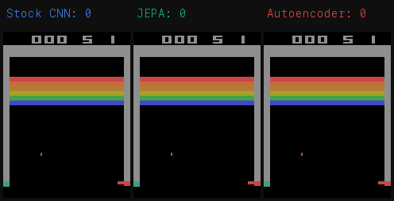

# JEPA Encoders for Visually Robust Atari Agents

Does replacing an RL agent's CNN encoder with a self-supervised [JEPA](https://arxiv.org/abs/2301.08243) encoder
make it more robust to visual perturbations?

**Yes** — on Breakout, a frozen JEPA encoder retains 76% of clean performance
under visual corruption, vs 61% for a standard end-to-end CNN. Under the
hardest perturbations, the JEPA agent outperforms the CNN despite lower clean
scores.

<p align="center">
  
  
</p>
<p align="center"><em>Left: clean environment. Right: hard visual perturbations (same agent).</em></p>

## Results

| Condition | Clean | Color Jitter | Noise | Mild | Hard | Robustness Ratio |
|---|---|---|---|---|---|---|
| **Stock CNN** | **7.6** +/- 0.3 | 7.5 +/- 0.4 | 5.5 +/- 0.1 | 3.4 +/- 0.1 | 2.2 +/- 0.1 | 0.612 |
| **JEPA** | 5.6 +/- 0.4 | 5.3 +/- 0.3 | **5.6** +/- 0.5 | **3.0** +/- 0.3 | **3.1** +/- 0.9 | **0.764** |
| Autoencoder | 2.0 +/- 0.1 | 2.0 +/- 0.1 | 2.0 +/- 0.1 | 1.9 +/- 0.0 | 2.0 +/- 0.0 | 0.971* |

*\*Autoencoder never exceeded random-policy performance, so its high ratio is trivially meaningless.*

**Robustness Ratio** = mean(perturbed reward / clean reward) across perturbation levels.

<p align="center">
  
  
</p>

## Motivation

RL agents trained on pixel observations are brittle: small visual changes
(color shifts, noise, brightness) can destroy performance even when the
underlying game state is identical. This mirrors the sim-to-real gap where
agents trained in simulation fail under real-world visual variation.

JEPA (Joint Embedding Predictive Architecture) learns to predict abstract
*representations* of masked image patches rather than reconstructing raw pixels.
The hypothesis is that this forces the encoder to capture scene structure (ball
position, paddle location) rather than surface-level pixel details, producing
representations that are inherently more robust to visual perturbation.

This project tests that hypothesis by:
1. Training a JEPA encoder (ViT-Tiny) self-supervised on Breakout gameplay frames
2. Training an autoencoder (same architecture) as a control condition
3. Plugging each frozen encoder into a PPO agent and comparing robustness

## Setup

Requires Python 3.13+ and [uv](https://docs.astral.sh/uv/).

```bash
git clone https://github.com/jzfcoder/atari-jepa.git
cd atari-jepa
uv sync
```

Hardware: runs on Mac (MPS), CUDA GPUs, or CPU. Single-seed training takes
~3-4 hours on Mac MPS, ~1 hour on a GPU.

## Usage

The experiment runs in 4 phases. Each phase builds on the previous one.

### Phase 1: Train baseline PPO agent

```bash
# Train PPO on Breakout (10M steps)
uv run python scripts/train_baseline.py

# Evaluate under visual perturbations
uv run python scripts/utils/measure_gap.py --model results/v0/ppo_*/final_model.pt
```

### Phase 2: Self-supervised encoder pretraining

```bash
# Collect gameplay frames for pretraining
uv run python scripts/collect_frames.py

# Train JEPA encoder
uv run python scripts/train_jepa.py

# Train autoencoder baseline (control)
uv run python scripts/train_autoencoder.py

# Verify encoder quality (PCA, nearest neighbors, linear probe)
uv run python scripts/utils/verify_encoders.py \
    --frames results/v0/frames.npz \
    --jepa-encoder results/v0/jepa/encoder_final.pt \
    --ae-encoder results/v0/autoencoder/encoder_final.pt
```

### Phase 3: Encoder-swap experiments

```bash
# Train PPO with each encoder (3 seeds x 3 conditions) + evaluate
uv run python scripts/run_phase3.py --config configs/phase3.yaml

# Or skip training and only evaluate (if models exist)
uv run python scripts/run_phase3.py --skip-training
```

### Phase 4: Analysis and visualization

```bash
uv run python scripts/utils/plot_robustness.py
uv run python scripts/utils/plot_learning_curves.py
uv run python scripts/utils/visualize_saliency.py
uv run python scripts/utils/generate_report.py
```

Outputs are saved to `results/v0/phase4/` including a full
[report](results/v0/phase4/REPORT.md).

## Architecture

```
agents/
  ppo_atari.py       # CleanRL-style PPO with swappable encoder
  encoder.py         # ViT-Tiny (patch_size=12, embed_dim=192, 4 layers, ~1M params)
  jepa.py            # JEPA: masked patch prediction in representation space
  autoencoder.py     # Pixel-reconstruction baseline (same ViT architecture)
env/
  perturbations.py   # Color jitter, noise, combined perturbation wrappers
  wrappers.py        # Standard Atari preprocessing
scripts/             # Training, evaluation, and analysis scripts
configs/             # YAML configs for each experiment phase
```

The key design choice is that `ppo_atari.Agent` takes an optional `encoder`
argument. When provided, the encoder is frozen and only the policy/value MLP
heads are trained. This makes it trivial to swap between CNN, JEPA, and
autoencoder encoders while keeping everything else identical.

## Key Findings

1. **JEPA produces more robust representations.** Under hard perturbations,
   JEPA (3.1 reward) beats the stock CNN (2.2) despite lower clean performance.

2. **The benefit is specific to JEPA's objective, not the architecture.** The
   autoencoder uses the same ViT-Tiny but fails entirely (~2.0, random-policy
   level), showing that pixel-reconstruction pretraining doesn't produce
   RL-useful representations.

3. **There's a robustness-performance tradeoff.** The frozen JEPA encoder
   can't match end-to-end CNN on clean performance (5.6 vs 7.6). Fine-tuning
   the encoder during RL may close this gap (planned for V1).

## Limitations

- **Single game** (Breakout only) — cross-game generalization is untested
- **Single seed for stock CNN** — limits statistical comparison
- **Frozen encoder only** — fine-tuning may yield better results
- See the full [report](results/v0/phase4/REPORT.md) for details

## License

[MIT](LICENSE)
