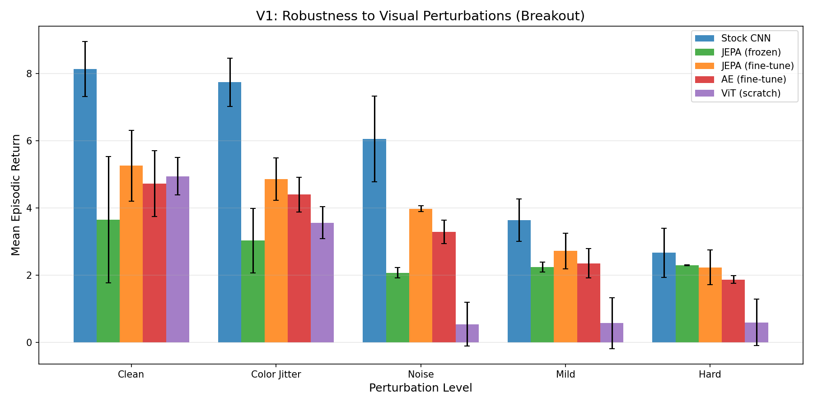
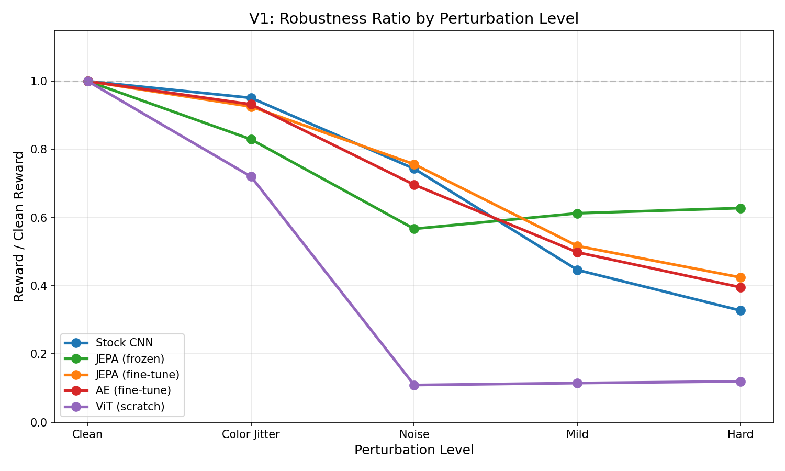
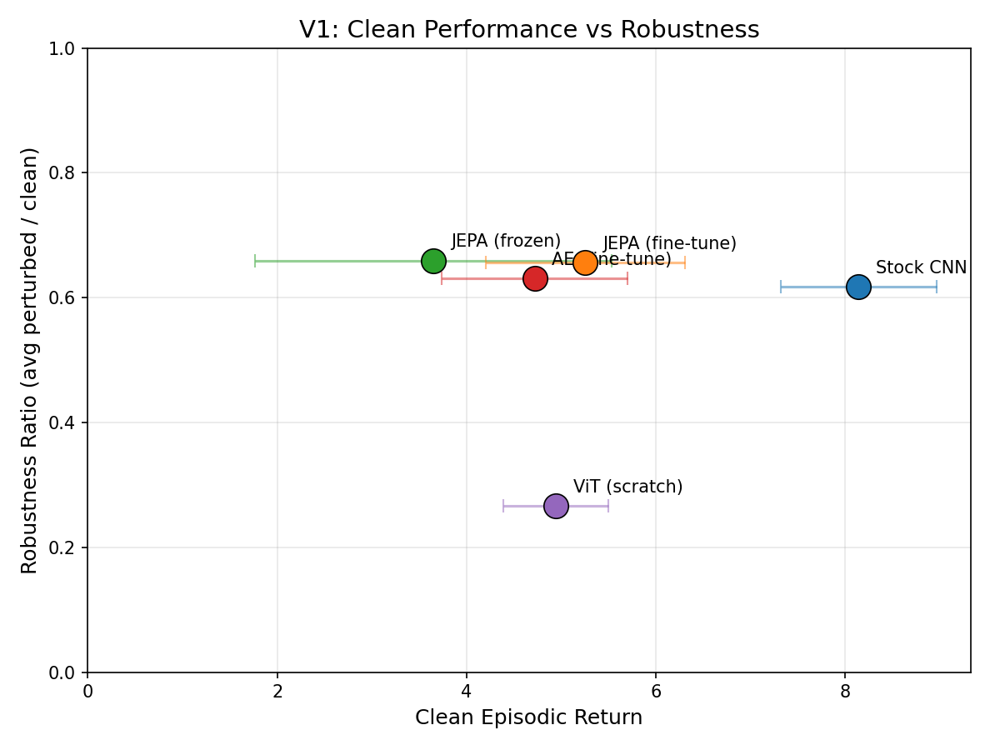
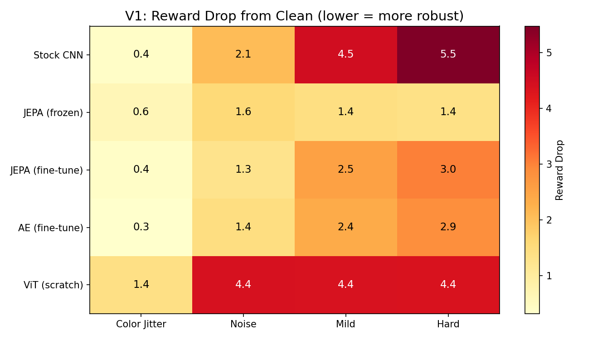
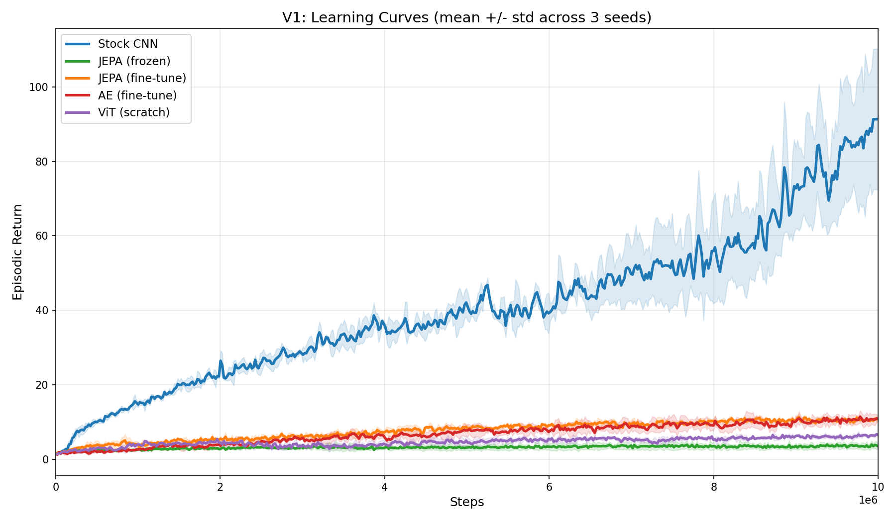

# V1 Results: Unfrozen Encoder Experiments

## Research Question

Can fine-tuning pretrained JEPA encoders during RL close the clean-performance
gap (observed in V0) while preserving robustness to visual perturbations?

## Experimental Setup

- **Environment**: ALE/Breakout-v5
- **Training**: 10M timesteps per run, PPO, 3 seeds per condition
- **Encoder fine-tuning**: `encoder_lr_scale = 0.1` (encoder LR = 10% of head LR)
- **Evaluation**: 50 episodes x 3 eval seeds per perturbation level

### Conditions

| Condition | Encoder | Init | Training Mode |
|---|---|---|---|
| Stock CNN | Nature-CNN | Random | End-to-end |
| JEPA (frozen) | ViT-Tiny | JEPA pretrained | Frozen encoder |
| JEPA (fine-tune) | ViT-Tiny | JEPA pretrained | End-to-end, 0.1x encoder LR |
| AE (fine-tune) | ViT-Tiny | AE pretrained | End-to-end, 0.1x encoder LR |
| ViT (scratch) | ViT-Tiny | Random | End-to-end, 1.0x encoder LR |

## Results

### Summary Table

| Condition | Clean | Color Jitter | Noise | Mild | Hard | Robust. Ratio |
|---|---|---|---|---|---|---|
| Stock CNN | **8.1** +/- 0.8 | **7.7** +/- 0.7 | **6.1** +/- 1.3 | **3.6** +/- 0.6 | **2.7** +/- 0.7 | 0.617 |
| JEPA (frozen) | 3.6 +/- 1.9 | 3.0 +/- 1.0 | 2.1 +/- 0.2 | 2.2 +/- 0.1 | 2.3 +/- 0.0 | **0.659** |
| JEPA (fine-tune) | 5.3 +/- 1.1 | 4.9 +/- 0.6 | 4.0 +/- 0.1 | 2.7 +/- 0.5 | 2.2 +/- 0.5 | 0.656 |
| AE (fine-tune) | 4.7 +/- 1.0 | 4.4 +/- 0.5 | 3.3 +/- 0.4 | 2.4 +/- 0.4 | 1.9 +/- 0.1 | 0.631 |
| ViT (scratch) | 4.9 +/- 0.6 | 3.6 +/- 0.5 | 0.5 +/- 0.7 | 0.6 +/- 0.8 | 0.6 +/- 0.7 | 0.266 |

Robustness ratio = mean(perturbed reward / clean reward) across all non-clean levels.

### Plots

#### Absolute Performance Under Perturbation


Stock CNN dominates on clean and color jitter, but the gap narrows under
heavier perturbations. JEPA (fine-tune) consistently outperforms JEPA (frozen)
at every perturbation level. ViT (scratch) collapses to near-zero on noise,
mild, and hard.

#### Robustness Ratio (Normalized Degradation)


JEPA (frozen) shows the flattest degradation curve — its representations are
the most invariant to perturbations. JEPA (fine-tune) tracks closely, losing
slightly more under mild/hard but retaining far more than Stock CNN. ViT
(scratch) drops off a cliff after color jitter.

#### Clean Performance vs Robustness (Pareto)


The ideal condition sits in the upper-right: high clean reward AND high
robustness ratio. **JEPA (fine-tune) is the Pareto-optimal condition** — it
achieves the best tradeoff between clean performance and robustness. Stock CNN
trades robustness for clean reward; JEPA (frozen) trades clean reward for
robustness.

#### Reward Drop Heatmap


Absolute reward drops from clean. Stock CNN loses 5.5 points under hard
perturbation — the largest drop. JEPA (frozen) loses only 1.4 — the smallest.
JEPA (fine-tune) loses 3.0, a middle ground. ViT (scratch) loses 4.4 across
all non-color perturbation types, confirming total fragility.

## Key Findings

### 1. Fine-tuning partially closes the clean gap without destroying robustness

JEPA (fine-tune) achieves 5.3 clean reward vs 3.6 for JEPA (frozen) — a **47%
improvement** — while maintaining a nearly identical robustness ratio (0.656 vs
0.659). The low encoder LR (0.1x) successfully preserves the pretrained
representations while allowing task-specific adaptation.

### 2. ViT architecture alone does not explain robustness

ViT (scratch) achieves reasonable clean performance (4.9) but collapses under
perturbation (robustness ratio 0.266). This is the critical control: it proves
that **JEPA pretraining, not the ViT architecture, is the source of
robustness**. A randomly initialized ViT trained end-to-end learns features
that are just as fragile as — or more fragile than — a CNN.

### 3. JEPA pretraining > AE pretraining for robustness

JEPA (fine-tune) outperforms AE (fine-tune) on both clean reward (5.3 vs 4.7)
and robustness ratio (0.656 vs 0.631). The predictive objective (JEPA) learns
more transferable and robust features than the reconstructive objective (AE).

### 4. A significant clean-performance gap remains

Stock CNN still leads on clean performance (8.1 vs 5.3), and learning curves
show it has not yet converged — the gap would likely widen with more training.



Stock CNN reaches 80-100 training return and is still climbing at 10M steps.
All ViT-based conditions plateau at 5-15 training return. This reflects a
fundamental sample-efficiency gap: CNNs have strong inductive biases (locality,
translation equivariance) that make them learn much faster on small 84x84 Atari
frames. ViTs lack these priors and need significantly more data to converge.

Even ViT (scratch) at full learning rate (`encoder_lr_scale=1.0`) cannot match
the CNN, confirming that the architecture — not the reduced encoder LR — is the
primary bottleneck.

### 5. CNN is likely optimal for this problem setting

Given the learning curve evidence, a CNN encoder is likely the better choice for
84x84 Atari RL at practical training budgets. The robustness ratio advantage of
JEPA (0.656 vs 0.617) is modest (+6% relative), and in absolute terms under
hard perturbation, the CNN (2.7) actually outperforms JEPA fine-tune (2.2)
because its higher clean performance provides more headroom.

However, the finding that JEPA pretraining *transfers robustness properties* is
still meaningful. The most promising direction would be applying JEPA-style
predictive pretraining to a CNN encoder, potentially combining the robustness
benefits with the sample efficiency of convolutional architectures.

## Hypothesis Evaluation

| Hypothesis | Result |
|---|---|
| JEPA-finetune matches Stock CNN clean performance | **Partial** — 47% gap closed (3.6 → 5.3 vs 8.1) |
| JEPA-finetune retains robustness | **Confirmed** — 0.656 vs 0.659 ratio |
| AE-finetune < JEPA-finetune | **Confirmed** — both clean (4.7 vs 5.3) and robust (0.631 vs 0.656) |
| ViT-scratch underperforms, proving pretraining matters | **Confirmed** — 0.266 ratio, catastrophic under perturbation |
| Low encoder LR prevents catastrophic forgetting | **Confirmed** — robustness ratio preserved |

## Limitations

- **Single game** — Breakout only; results may differ on games with richer visual structure
- **Single encoder LR scale** — only tested 0.1; higher values (0.3, 0.5) might close the gap further at the cost of robustness
- **ViT-Tiny only** — larger ViTs or hybrid CNN-ViT architectures might perform differently
- **10M steps** — ViT-based conditions have not converged; longer training would change the picture (though likely in CNN's favor)

## Future Directions

- **JEPA pretraining on CNN encoders** — apply the predictive objective to a Nature-CNN, combining robustness with sample efficiency
- **Higher encoder_lr_scale** — sweep 0.1 / 0.3 / 0.5 / 1.0 to map the robustness-performance tradeoff curve
- **Curriculum unfreezing** — freeze encoder for initial training, gradually unfreeze
- **Cross-game evaluation** — test on Pong, Space Invaders, etc.

## Reproducing

```bash
# Training (all 15 runs)
uv run python scripts/run_v1.py

# Evaluation only (models must exist)
uv run python scripts/run_v1.py --skip-training

# Generate plots
uv run python scripts/plot_v1.py
uv run python scripts/plot_learning_curves_v1.py
```

## Files

- `results/v1/v1_results.json` — raw evaluation data
- `results/v1/v1_results.txt` — formatted comparison table
- `results/v1/plots/` — all analysis plots
- `scripts/run_v1.py` — training + evaluation orchestrator
- `scripts/plot_v1.py` — plot generation
- `scripts/plot_learning_curves_v1.py` — learning curve plots
- `configs/v1.yaml` — experiment configuration
