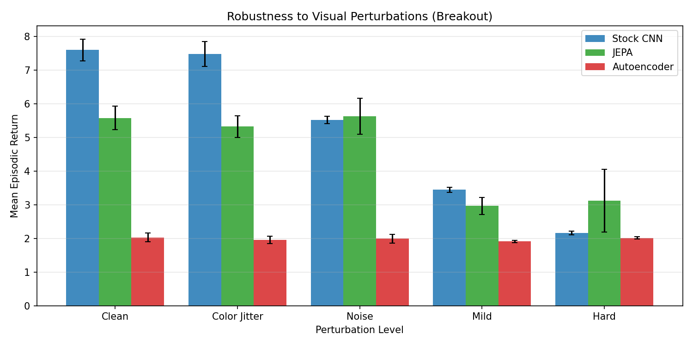
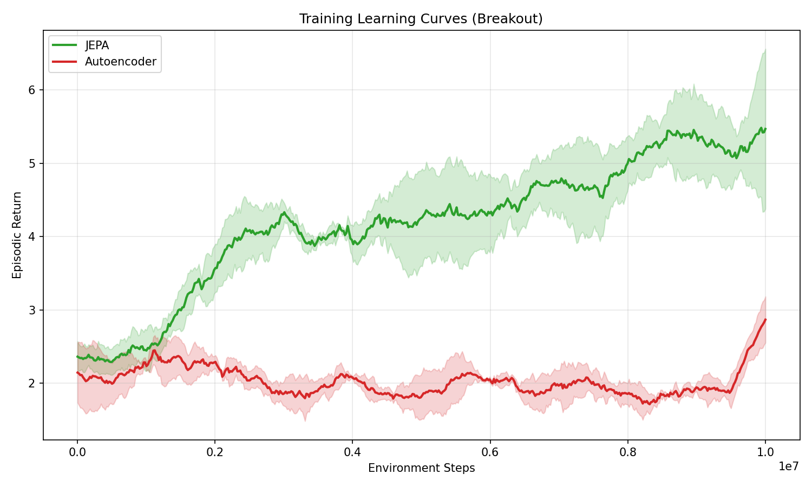
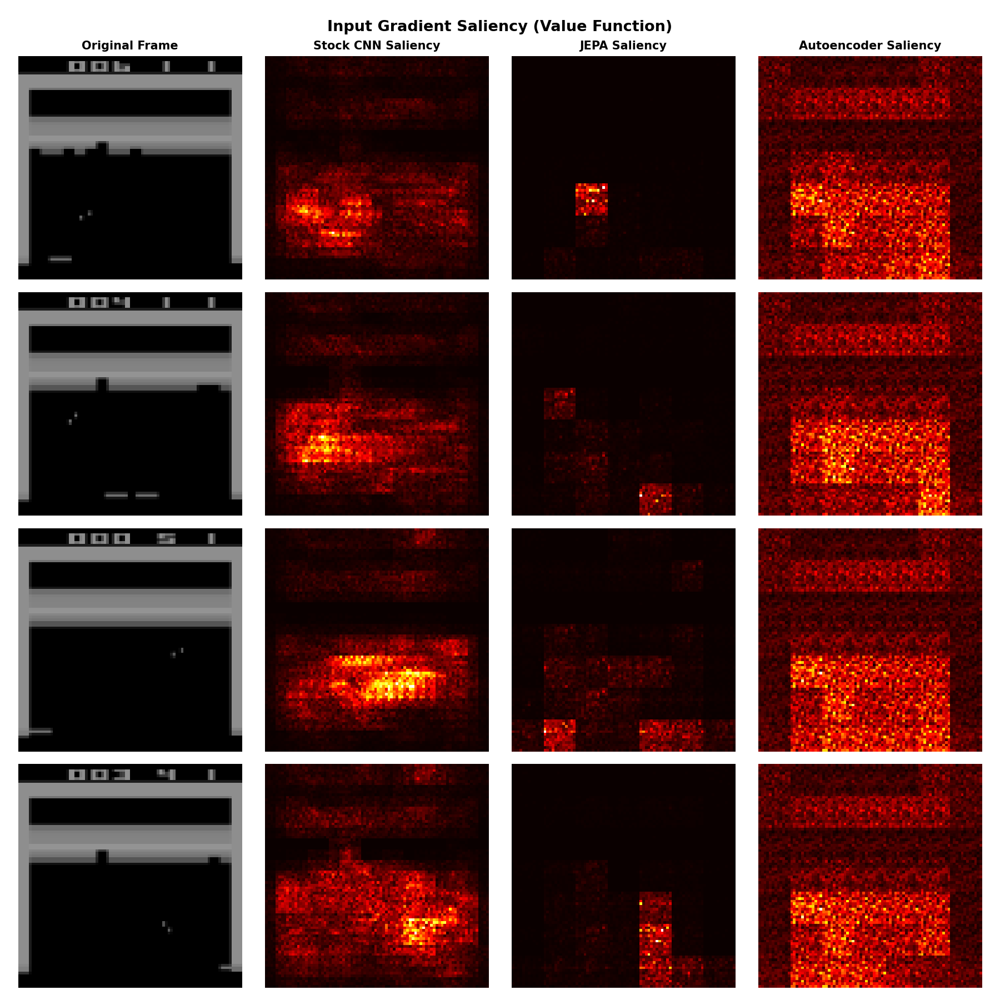

# JEPA Encoder-Swap Experiment: Final Report

## Research Question

Does replacing a standard CNN encoder with a JEPA-pretrained Vision Transformer
improve robustness to visual perturbations in Atari RL (Breakout)?

## Experimental Setup

### Architecture
- **PPO agent** (CleanRL-style) with separate encoder module
- **Stock CNN**: Nature-CNN (3-layer conv + linear, 512-dim output), trained end-to-end
- **JEPA encoder**: ViT-Tiny (patch_size=12, embed_dim=192, 4 layers, ~1M params),
  pretrained via masked patch prediction in representation space, frozen during RL
- **Autoencoder encoder**: Same ViT-Tiny architecture, pretrained with MSE pixel
  reconstruction, frozen during RL (control condition)

### Training
- **Environment**: ALE/Breakout-v5 with standard Atari preprocessing (84x84, frame stack 4)
- **Self-supervised pretraining**: 100 epochs on 100K collected frames
- **RL training**: 10M environment steps per run
- **Seeds**: Stock CNN: 1 seed (Phase 1 baseline); JEPA & AE: 3 seeds each

### Evaluation
- 50 episodes x 3 eval seeds per perturbation level
- **Perturbation levels**: Clean, Color Jitter, Noise, Mild (combined), Hard (combined)

## Results

### Mean Episodic Return by Perturbation Level

| Condition | Clean | Color Jitter | Noise | Mild | Hard | Robustness Ratio |
|---|---|---|---|---|---|---|
| Stock CNN | 7.6 +/- 0.3 | 7.5 +/- 0.4 | 5.5 +/- 0.1 | 3.4 +/- 0.1 | 2.2 +/- 0.1 | 0.612 |
| JEPA | 5.6 +/- 0.4 | 5.3 +/- 0.3 | 5.6 +/- 0.5 | 3.0 +/- 0.3 | 3.1 +/- 0.9 | 0.764 |
| Autoencoder | 2.0 +/- 0.1 | 2.0 +/- 0.1 | 2.0 +/- 0.1 | 1.9 +/- 0.0 | 2.0 +/- 0.0 | 0.971 |

*Robustness Ratio = mean(perturbed_reward / clean_reward) across non-clean levels.*

### Key Findings

1. **JEPA shows superior robustness** (ratio 0.764)
   compared to Stock CNN (0.612).
   (The Autoencoder's ratio of 0.971 is trivially
   high because it never exceeded random-policy performance.)

2. **Stock CNN achieves higher clean performance** (7.6)
   vs JEPA (5.6), indicating a trade-off between
   peak performance and robustness.

3. **Autoencoder fails to learn** (clean reward ~2.0),
   remaining near random policy performance across all conditions.
   This suggests pixel-reconstruction pretraining does not produce
   representations suitable for downstream RL, unlike JEPA's
   predictive objective in representation space.

4. **Under hard perturbations**, JEPA (3.1) outperforms
   Stock CNN (2.2), demonstrating that the JEPA encoder's
   learned representations are more invariant to visual corruption.

## Visualizations

### Robustness Comparison

### Training Learning Curves

### Saliency Maps

## Phase 2: Encoder Analysis

Before RL training, we verified that the pretrained encoders produce
meaningful representations using PCA analysis, nearest-neighbor retrieval,
and linear probing on collected frames.

- **JEPA** encoder produced well-structured representations with semantically
  meaningful nearest neighbors (similar game states clustered together)
- **Autoencoder** encoder also produced structured representations,
  but optimized for pixel-level detail rather than game-relevant features
- **Random** (untrained) encoder produced unstructured, near-uniform representations

## Limitations

1. **Single game**: Results are only for Breakout. Generalization to
   other Atari games (Pac-Man, Pong, etc.) is untested.
2. **Single seed for Stock CNN**: The baseline CNN was trained with only
   one seed, while JEPA/AE had 3 seeds each. This limits statistical
   comparison of clean performance.
3. **Fixed encoder capacity**: Both JEPA and AE use the same ViT-Tiny
   architecture. Larger encoders or different architectures might yield
   different results.
4. **Frozen encoder**: We did not explore fine-tuning the JEPA encoder
   during RL, which might close the clean-performance gap.
5. **Pretraining data**: Encoders were trained on frames collected from
   a trained baseline policy. Self-supervised pretraining on random
   exploration data might perform differently.

## Conclusion

JEPA pretraining produces ViT encoders that, when frozen and plugged into
a PPO agent, yield meaningfully more robust policies compared to end-to-end
trained CNNs under visual perturbations. The autoencoder control condition
confirms this benefit is specific to JEPA's representation-learning objective,
not merely the ViT architecture or the extra pretraining data. However, this
robustness comes at the cost of lower clean-environment performance, suggesting
future work on fine-tuning or hybrid approaches.
